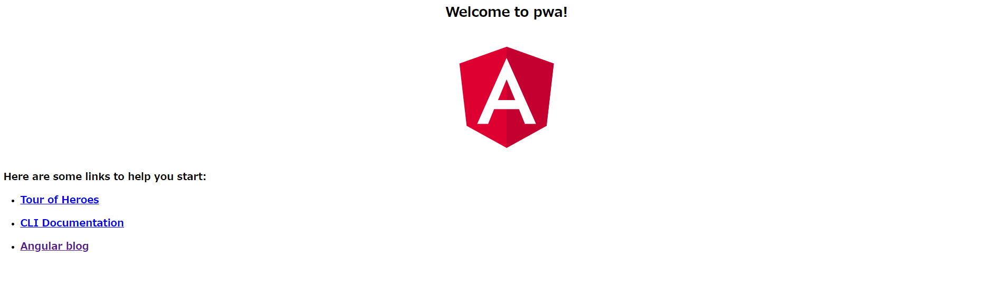
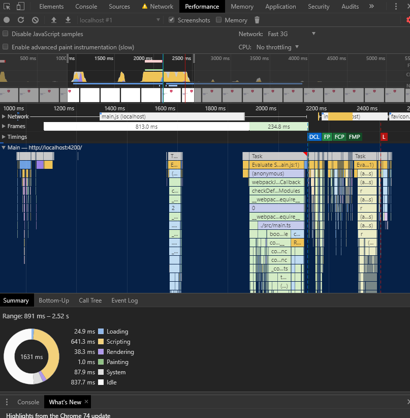
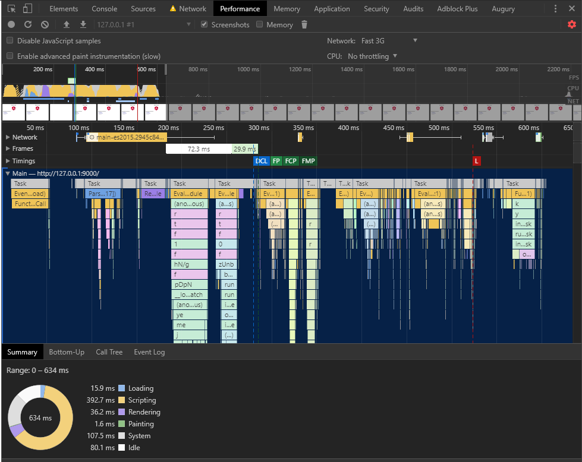

## Angular で PWA

---

### Agenda

>>>

- PWA とは？
- Angularアプリケーションの作成
- PWA化
- デプロイ

---

### PWA とは？

>>>

`Progressive Web Apps`

>>>

> プログレッシブウェブアプリは、デスクトップとモバイルの両方でインストール可能なアプリと同等の体験を提供し、ウェブ上で直接構築・配信される高速で信頼性の高いウェブアプリです。何より重要なのは、それらがどのブラウザでも動作するウェブアプリであることです。

>>>

- WebアプリなのにネイティブアプリっぽいUI
- ホーム画面にアイコン表示
- プッシュ通知
- 高速
- オフラインでの動作

>>>

「Webアプリでネイティブのモバイルアプリと同様のUXの提供を目的」

>>>

ex.)

- Twitter
- Instagram
- 日本経済新聞（日経電子版）
- アイドルマスターシャイニーカラーズ

>>>

Angular CLI を使えばPWA化も簡単！

---

### アプリケーションの作成

>>>

事前準備
- node.js
- Angular CLI

>>>

```
$ ng new pwa
$ cd pwa
$ npm i
$ ng s -o
```

>>>



---

### PWA化

>>>

```
$ ng add @angular/pwa --project ng-pwa
```

>>>

#### その１

`app.module.ts` のインポートに `@angular/service-worker` パッケージを追加

```javascript
import{ ServiceWorkerModule } from ‘@angular/service-worker’;

@NgModule({ ..
  imports: [ …
    ServiceWorkerModule.register(‘ngsw-worker.js’,
    { enabled: environment.production })
  ] …
```

>>>

#### その2

srcフォルダに `manifest.json` と `ngsw-config.json` の2つのファイルを作成し、`angular.json` の asetts に `manifest.json` を追加

```javascript
“assets”: [
  “src/favicon.ico”,
  “src/assets”,
  “src/manifest.json”
]
```

>>>

#### その3

`manifest.json` へのリンクとテーマカラーのメタタグをindex.htmlに追加

```html
<link rel=”manifest” href=”manifest.json”>
<meta name=”theme-color” content=”#1976d2">
```

>>>

ビルドする

```
$ ng build --prod
```

>>>

httpサーバを起動

```
$ npx node-static ./dist/ng-pwa --spa --port=9000
```

>>>

非PWA

>>>



>>>

PWA

>>>



---

### デプロイ

>>>

Netlify

<br>
https://www.netlify.com/

>>>

- 静的コンテンツのホスティングサービス
- GitHub / GitLab / Bitbucket のリポジトリと連携
- pushやmergeがあったらNetlifyCIがビルドやデプロイをしてくれる感じ

>>>

TODO: スマホの画面
